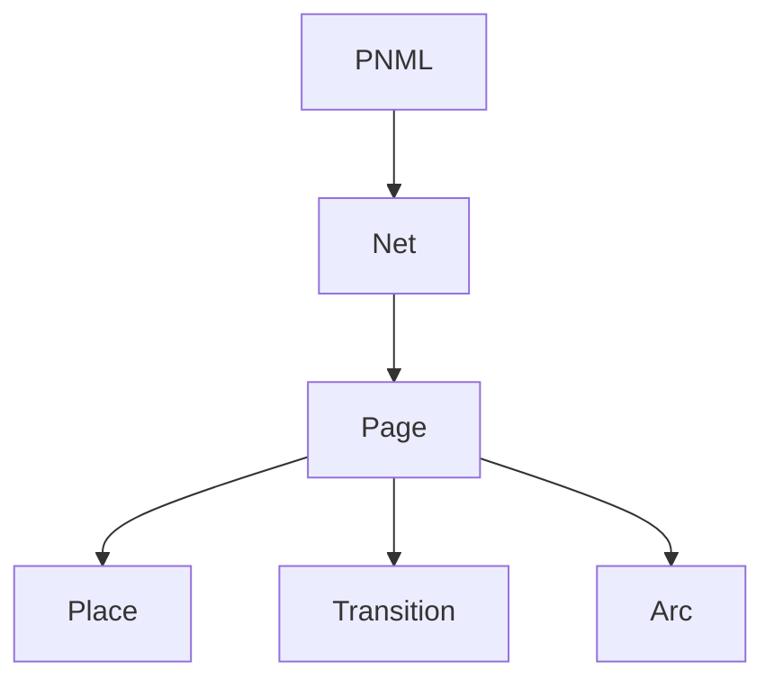

# Petri Net (PNML YAML)
 
 ## Implementation in EVOLVE
 - Parsed into enginepy.pnml_parser.PNMLNet with fields:
	 - id
	 - places: map of place id to Place
	 - transitions: map of transition id to Transition
	 - arcs: list of Arc
 - parse_pnml also builds a PlaceIndex list used by editor and debugger.
 
 ## Supported YAML structure
 - Parser understands sections: net, place, transition, arc, initialTokens, inscriptions.
 - Nested containers (such as page, evolve, name) are ignored structurally and only used for nesting.
 - initialTokens are collected from list items with value fields.
 
 ## Runtime model
 - PNMLEngine builds input/output maps from arcs.
 - Execution is token-based, without timing or priorities.

## Structure diagram


## Example (minimal net)
```yaml
pnml:
	net:
		- id: demo
			page:
				- id: page1
					place:
						- id: p1
					transition:
						- id: t1
					arc:
						- id: a1
							source: p1
							target: t1
```
