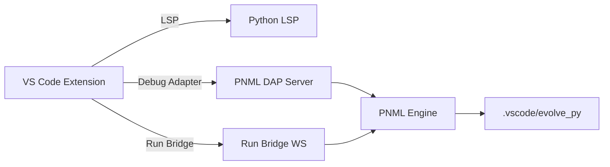
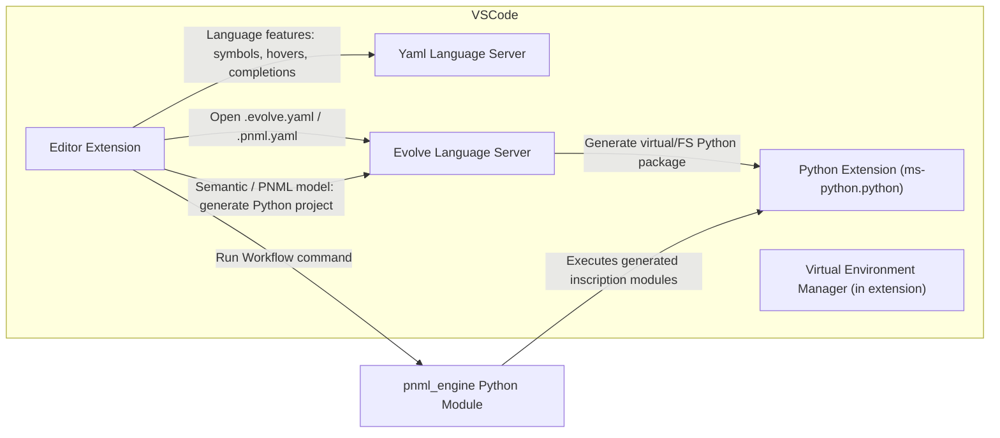
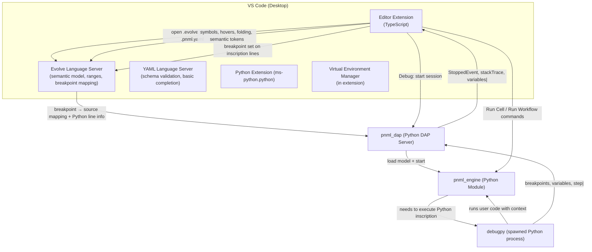
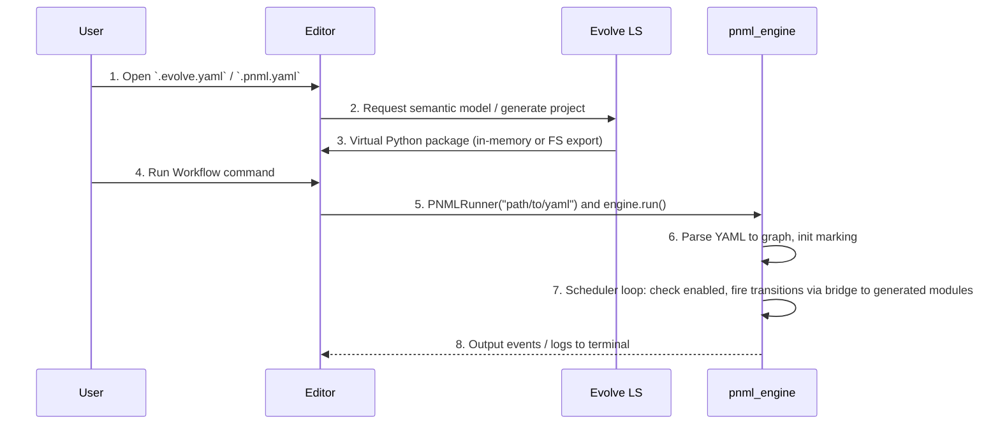
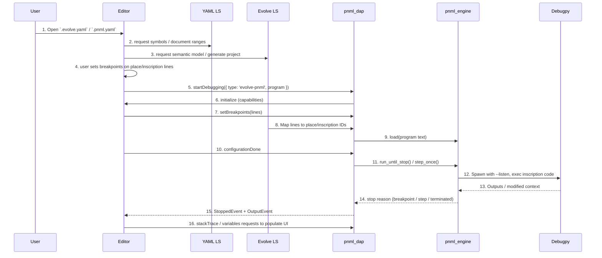

# Development Overview
 
 ## Implemented architecture (current codebase)
 - VS Code extension (editor/) provides editing, debugging, and inscription tooling.
 - Language server (ls/server.py) offers minimal LSP features and code generation.
 - Python runtime (enginepy/) implements parsing, execution, debug adapter, and VS Code bridge.
 
 ## Runtime flow
 1. User edits PNML YAML in VS Code.
 2. Optional: command evolve.generatePython creates a runnable Python project under .vscode/evolve_py.
 3. Run uses PNMLEngine directly; debug uses PNMLDAPServer.
 4. During debug, Python inscriptions can call VSCodeBridge APIs.

## Architecture (current implementation)

# Run and Debug Pipeline — EVOLVE PNML Engine and Debugger 🛠️

This document describes the design and runtime wiring for both run mode (non-debug execution) and debug mode in the EVOLVE PNML system. It focuses on the current Python-based implementation, where the Language Server (LS) generates executable Python projects from PNML YAML files. The execution engine is a static Python module handling Petri net semantics, with native integration for Python inscriptions. Notes are included for future extensions to other languages (e.g., TypeScript, Rust) via pluggable adapters and WASM.

Regarding migration of the Debug Adapter Protocol (DAP) implementation: Yes, the DAP should migrate to Python for alignment with the Python-based engine and LS. This reduces cross-language complexity, leverages Python DAP libraries (e.g., pydevd or a custom implementation using the DAP spec), and simplifies maintenance/debugging. The current Rust DAP (pnets_dap) can be phased out, with a Python DAP server (e.g., using `debugpy` as a base or a lightweight DAP framework like `py-dap`) handling requests. This migration enhances native integration while preserving performance for desktop use; for high-scale scenarios, retain Rust hooks via PyO3 if needed.

---

## Overview

- **Editor Extension** (`editor/src/extension.ts`): Provides UI for Run/Debug, breakpoint management (in debug mode), and integrates with the Evolve Language Server for semantic features. Registers commands to generate Python projects and launch run/debug sessions.
- **Evolve Language Server (LS)**: Parses PNML YAML, generates virtual/in-memory Python packages (e.g., `__init__.py` from declarations, modules from inscriptions, `main.py` for bootstrap). Handles multi-language routing in future.
- **PNML Execution Engine** (`pnml_engine`): Static Python module for parsing YAML to graph, maintaining marking/enabled transitions, scheduling (with async support), and bridging to inscription code. In run mode, executes directly; in debug mode, integrates with debugpy.
- **Python DAP Server** (Migrated from Rust `pnets_dap`): Implements DAP in Python, proxying to debugpy for inscription debugging and engine for net-level control.
- **Debugpy Integration** (for Debug Mode): Spawns a Python process with debugpy for line-level debugging of inscriptions, proxying through the DAP server.

The system treats PNML YAML as a declarative workflow that "compiles" to a runnable Python application, enhancing Jupyter-like interactivity while supporting complex dataflows.

---

## Developer Environment & Architecture 🔧

Below are updated diagrams reflecting the Python-focused design. The engine and DAP are now Python-based for native integration, with hooks for Rust hybridization (via PyO3) for performance if needed.

### Architecture (Component Diagram) - Run Mode

In run mode, the focus is on direct execution without debugging overhead.



### Architecture (Component Diagram) - Debug Mode

Debug mode adds breakpoint mapping, history tracking, and integration with debugpy for inscription debugging.



**Notes for Future Languages**:
- For TypeScript/Rust, the LS would generate language-specific projects (e.g., `index.ts` + `package.json` for TS). The engine could remain Python, bridging via subprocess (for TS/Node) or compiled binaries (for Rust). In long-term, migrate to WASM with WIT interfaces for unified calling (e.g., engine invokes WASM `run(inputs)` funcs). DAP would proxy to lang-specific debuggers (e.g., Node inspect for TS).

---

## Sequence Diagrams

### Sequence (Open File & Run Mode)



### Sequence (Open File & Debug Mode)



**Notes for Future Languages**: In debug mode, replace debugpy with language debuggers (e.g., Node inspect for TS, gdb/lldb for Rust). Use DAP proxying to standardize events. Sequence would extend with lang-specific exec steps (e.g., compile for Rust).

---

## Goals

- **Run Mode**: Efficient, non-debug execution of PNML workflows as Python applications, with native calls to inscriptions for full lib support (e.g., LangChain imports).
- **Debug Mode**: Allow breakpoints on places (net-level) and inscription lines (code-level), pausing on token production or code execution. Integrate debugpy for step-through in Python code.
- Common: Record history/marking, support async token generation (pause firings for awaits), expose APIs for token ingestion/monitoring.
- Future: Pluggable languages with native Python preserved, others via WASM/WIT for unified bridging.

---

## Runtime Flow (User Action → Execution/Paused State)

### Run Mode
1. User opens PNML YAML; LS generates Python project (virtual or exported).
2. User runs via command: Extension spawns `python main.py` or imports engine directly.
3. Engine parses YAML to graph, initializes marking from declarations.
4. Scheduler loop: Checks enabled transitions (tokens + guards), queues/fires via bridge (direct call to generated `run(inputs)`).
5. For async: If inscription returns awaitable, scheduler pauses until resolved.
6. Outputs logs/results to terminal; APIs allow external control.

### Debug Mode
1. Similar to run, but user starts debug session.
2. DAP server launches, loads via engine, sets breakpoints (mapped by LS).
3. Execution: `continue` runs until breakpoint/termination; `next/step` fires one transition.
4. On inscription exec, engine spawns debugpy process (--listen), proxies via DAP.
5. On stop: Send `StoppedEvent`, populate stack/variables with history/marking.

**Notes for Future Languages**: Bridge uses adapters; for Rust, compile on-fly and call binary. Async handling via language futures (e.g., Rust async blocks).

---

## Breakpoint Mapping & Validation (Debug Mode)

- Breakpoints allowed on place IDs (net stops) or inscription lines (code stops).
- LS maps YAML lines → place/inscription IDs; DAP stores by ID.
- Verified in `SetBreakpointsResponse`; stops when tokens hit breakpointed place or debugpy pauses in code.

**Notes for Future Languages**: Extend mapping to lang-specific sources (e.g., .rs lines for Rust).

---

## Execution History and Stack Frames (Debug Mode)

- Records `HistoryEntry`: {step, transitionId, produced places, marking}.
- `stackTrace`: Reversed history as frames, mapping to YAML lines.
- `scopes/variables`: Current marking (tokens per place).

**Notes for Future Languages**: Serialize history JSON for cross-lang compatibility.

---

## UI Behavior and Best Practices

- **Run Mode**: Terminal output for logs; use CodeLens for "Run Workflow" above YAML.
- **Debug Mode**: Standard debug toolbar; highlight paused lines; Variables shows marking; Debug Console gets traces.
- Best Practices: Use virtual envs for deps; export projects for standalone runs.

**Notes for Future Languages**: UI extensions for lang-specific previews (e.g., TS type hints).

---

## Testing & Automation

- **Numerized Unit Test Cases** (Focus on Engine/LS; using pytest for Python components):
  1. Parse YAML to graph: Assert adjacency list matches expected structure.
  2. Marking initialization: Verify initial tokens from declarations.
  3. Enabled transitions check: Given marking, assert correct enabled list.
  4. Scheduler firing: Simulate fire, check updated marking.
  5. Async pause: Test inscription awaitable, ensure scheduler waits.
  6. Bridge execution: Mock inscription, verify inputs/outputs.
  7. LS generation: Assert generated `__init__.py` and modules match YAML.
  8. DAP initialize: Verify capabilities response.
  9. setBreakpoints mapping: Assert line → ID conversion.
  10. History recording: After step, assert entry added.

- **Numerized Automation/Integration Test Cases** (End-to-end via `@vscode/test-electron`):
  1. Open PNML YAML, generate project: Assert FS/virtual files created.
  2. Run workflow: Assert terminal output matches expected marking/logs.
  3. Set breakpoint on place: Start debug, assert stop on token production.
  4. Step through inscription: Assert debugpy pauses, variables show context.
  5. Continue to termination: Assert TerminatedEvent, full history in stack.
  6. Async token handling: Simulate await, assert scheduler resumes correctly.
  7. API ingestion: Call ingest_tokens, assert updated marking.
  8. Error recovery: Induce inscription error, assert graceful handling/logs.

- Run via `npm --prefix editor test`.

**Notes for Future Languages**: Add lang-specific units (e.g., Rust compile tests via Cargo); integration for WASM exec (assert WIT calls).

### Traceability Matrix

This matrix maps sequence diagram steps to test cases for coverage.

| Sequence Diagram | Step Number | Mapped Unit Test Case(s) | Mapped Automation Test Case(s) |
|------------------|-------------|--------------------------|--------------------------------|
| Run Mode        | 1          | N/A (UI)                | 1                             |
| Run Mode        | 2          | 7                       | 1                             |
| Run Mode        | 3          | 7                       | 1                             |
| Run Mode        | 4          | N/A (UI)                | 2                             |
| Run Mode        | 5          | N/A                     | 2                             |
| Run Mode        | 6          | 1, 2                    | 2                             |
| Run Mode        | 7          | 3, 4, 5, 6              | 2, 6                          |
| Run Mode        | 8          | N/A                     | 2                             |
| Debug Mode      | 1          | N/A (UI)                | 1                             |
| Debug Mode      | 2          | N/A                     | N/A                           |
| Debug Mode      | 3          | 7                       | 1                             |
| Debug Mode      | 4          | N/A (UI)                | 3                             |
| Debug Mode      | 5          | N/A                     | 3                             |
| Debug Mode      | 6          | 8                       | N/A                           |
| Debug Mode      | 7          | 9                       | 3                             |
| Debug Mode      | 8          | 9                       | 3                             |
| Debug Mode      | 9          | 1                       | N/A                           |
| Debug Mode      | 10         | N/A                     | N/A                           |
| Debug Mode      | 11         | 3, 4, 10                | 4, 5                          |
| Debug Mode      | 12         | 6                       | 4                             |
| Debug Mode      | 13         | 6                       | 4                             |
| Debug Mode      | 14         | 10                      | 3, 5                          |
| Debug Mode      | 15         | N/A                     | 3, 5                          |
| Debug Mode      | 16         | 10                      | 3, 5                          |

---

## Quick Launch Snippets (Attach Workflows)

- Attach to debugpy (Python):
```json
{
  "name": "Attach to debugpy",
  "type": "python",
  "request": "attach",
  "connect": { "host": "localhost", "port": 5678 },
  "pathMappings": [{ "localRoot": "${workspaceFolder}", "remoteRoot": "." }]
}
```

- For engine (if Rust-hybrid): Use gdb/lldb as before.

**Notes for Future Languages**: Add configs for Node debug (TS) or Rust lldb.

---

## Python-Native Engine Design

Engine (`pnml_engine.py`): Uses `networkx` for graph, `asyncio` for scheduling.

- Transport: Direct import in `main.py`.
- State: Marking dict, history list.
- Execution: Async loop for firing, bridge via adapters.

### Key Handlers
- Parse: YAML → adjacency list/graph.
- Scheduler: Queue enabled, handle async awaits.
- Bridge: `adapter.execute(transition, inputs)`.

**Notes for Future Languages**: Adapters for WASM (wasmtime-py), with WIT for interfaces.

---

## Implementation Plan

### Epic 1 — Python Engine Foundation
- Story 1.1: Implement parsing/marking/scheduler.
- Story 1.2: Bridge for Python inscriptions.

### Epic 2 — Run Mode
- Story 2.1: LS project generation.
- Story 2.2: main.py bootstrap.

### Epic 3 — Debug Mode
- Story 3.1: Integrate debugpy spawning.
- Story 3.2: DAP handlers for history/variables.

### Epic 4 — VS Code Wiring
- Story 4.1: Extension commands for generate/run/debug.
- Story 4.2: Automation tests.

**Notes for Future Languages**: Epic 5: Add adapters/WASM support.

---

## Key Files

- LS: `ls/pnml_ls.py` (pygls-based).
- Engine: `enginepy/pnml_engine.py`.
- DAP: `enginepy/pnml_dap.py` (Python, migrated from Rust).
- Extension: `editor/src/extension.ts`.
- Tests: `editor/test/suite/runNet.test.ts`.

---

## Design Trade-offs & Next Steps

- Trade-offs: Python engine/DAP simplifies dev but may need Rust for perf (use PyO3). Native Python > WASM for now due to lib support.
- Next Steps: Profile engine for hotspots; add async benchmarks; prototype TS adapter with WASM.

**Notes for Future Languages**: Standardize adapters with abstract class; explore WIT for cross-lang calls; ensure LS handles multi-lang YAML.