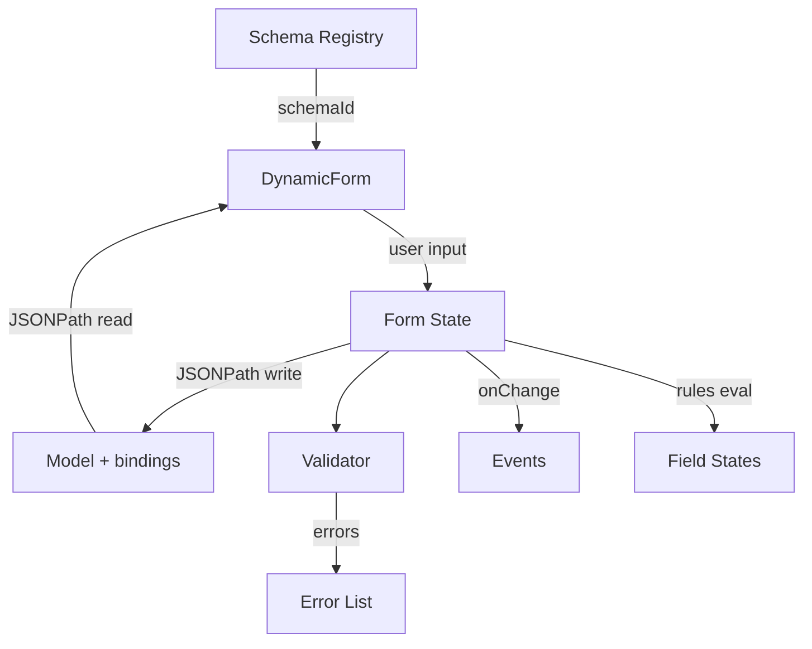

```markdown
# Dynamic Form (Webview) Pattern

## Overview
DynamicForm is a JSON Schema–driven renderer with optional bindings to an external model (JSONPath), uiSchema-driven ordering/widgets, and a dynamic rule engine for visibility/enablement/schema updates. It is implemented as a React component and is wrapped by a PageBuilder adapter that parses serialized attributes (schema id, initial value, bindings, rules, uiSchema) for use in a webview or editor host.

Note: This document is self-contained and does not depend on external repositories. It describes the required behaviors, data contracts, and integration points that must exist in any implementation.

## Inputs and data flow
DynamicForm is driven by three inputs:
1. **JSON Schema** (required): resolved by `schemaId` in the `schemaRegistry`.
2. **Form data** (optional): `value` for controlled usage or an internal state otherwise.
3. **Bindings** (optional): `bindings` map relative form paths to JSONPath in an external `model`.

### Schema resolution
DynamicForm looks up schema via `schemaRegistry.get(schemaId, schemaVersion)`. If missing, it attempts to fetch the schema from a dictionary URL (if `useSystemSettings()` provides one), then registers it automatically.

Behavioral requirements:
- Use a `schemaRegistry` to resolve schemas by `schemaId` and optional `schemaVersion`.
- If missing, optionally attempt a dictionary fetch (if a dictionary URL is available), then register the schema.
- Re-render when the schema becomes available.

### Data flow (value vs model bindings)
DynamicForm supports two data sources:
- **Controlled value**: if `value` is provided, it becomes the single source of truth.
- **Bindings**: when `bindings` and `model` are provided and `value` is undefined, the form reads values from `model` using JSONPath and writes updates back via a JSONPath setter.

Bindings are defined as a map from relative form path (dot notation) to JSONPath in the external model, e.g.:
```json
{
	"customer.name": "$.customer.profile.name",
	"customer.age": "$.customer.profile.age"
}
```

When the user edits a field, DynamicForm updates its internal data and, if bound, writes into `model` and triggers `onModelChange`.

## JSON Schema and uiSchema
DynamicForm consumes standard JSON Schema object definitions. Key supported aspects in the renderer:
- `type`: `object`, `array`, `string`, `number`, `integer`, `boolean`
- `title`, `description` for labels and tooltips
- `properties` for objects
- `items` for arrays

`uiSchema` controls order and widget rendering:
- Root `uiSchema["ui:order"]` for root property ordering
- Nested `uiSchema[path]["ui:order"]` for nested objects
- `uiSchema[path]["ui:widget"]` for primitive rendering (e.g., textarea)

Example JSON Schema and uiSchema:
```json
{
	"schema": {
		"type": "object",
		"title": "Customer",
		"properties": {
			"name": { "type": "string", "title": "Name" },
			"bio": { "type": "string", "title": "Bio" },
			"age": { "type": "number", "title": "Age" },
			"tags": { "type": "array", "items": { "type": "string" } }
		}
	},
	"uiSchema": {
		"ui:order": ["name", "bio", "age", "tags"],
		"bio": { "ui:widget": "textarea", "rows": 4 }
	}
}
```

## Layout modes
DynamicForm supports:
- `auto`: responsive grid for primitives and accordion panels for objects/arrays.
- `vertical-table`: table layout for compact, read-only friendly presentation.
- `custom-page`: placeholder (falls back to auto for now).

## Validation
Validation uses an AJV-compatible validator (configured with `allErrors: true`) and emits:
- `onValidate(valid, errors)` callback
- `emitEvent('onValidate', payload)` if `emitEvent` and `componentId` are set

Errors are displayed in a simple list at the bottom of the form.

## Dynamic rules
Dynamic rules are defined with `FieldRule` and processed by a global rule engine:
- Conditions: `equals`, `contains`, `range`, `exists`, `and`, `or`, `not`, `custom`.
- Actions: `visibility`, `enabled`, `schema`, `transform`, `custom`.

The form evaluates rules after data changes and updates `fieldStates` for visibility/enablement and transforms.

Example rule:
```json
{
	"id": "show-advanced",
	"condition": { "type": "equals", "field": "$.showAdvanced", "value": true },
	"action": { "type": "visibility", "field": "$.advanced", "visible": true }
}
```

## Events and actions
DynamicForm exposes an event surface (for the vComponent registry):
- `onChange` (path/value/fullData)
- `onSubmit` (data)
- `onValidate` (valid/errors)

The PageBuilder wrapper parses serialized attributes and can execute optional event scripts:
- `data-onChange-script`
- `data-onSubmit-script`
- `data-onValidate-script`

## Building a dynamic form from JSON schema or JSON object
### From JSON schema
1. Register the JSON schema in `schemaRegistry` with an id.
2. Render `DynamicForm` with `schemaId` and optional `value`, `uiSchema`, `bindings`, `rules`.

Minimal example (conceptual):
```ts
schemaRegistry.register({
	id: 'customer',
	version: '1.0.0',
	name: 'Customer',
	createdAt: new Date().toISOString(),
	updatedAt: new Date().toISOString(),
	schema: { type: 'object', properties: { name: { type: 'string' } } }
});

<DynamicForm schemaId="customer" value={{ name: 'Ada' }} />
```

### From JSON object
DynamicForm is schema-first; JSON objects are rendered by pairing them with a schema and optional bindings:
- If you only have an object, synthesize a schema that matches its shape (e.g., for quick prototyping).
- Provide the object as `value` for controlled data, or as `model` with `bindings` to map external paths.

Recommended approach for webview forms:
1. Generate or select a schema for the object shape.
2. Pass the object as `value` (or `model` + `bindings`).
3. Optionally provide `uiSchema` to define order and widgets.

## PageBuilder/webview integration
`PageBuilderDynamicForm` reads data attributes, parses JSON, and calls `DynamicForm`:
- `data-schema-id`
- `data-form-layout`
- `data-readonly`
- `data-initial-value`
- `data-bindings`
- `data-ui-schema`
- `data-rules`

## EVOLVE usage (async form)
For EVOLVE async `operationType: form`, serialize the form spec (schemaId/value/uiSchema/bindings/rules) into `uiState.formSpec`, render the DynamicForm in a webview, then return the submitted data to the extension and resume execution via `asyncOperationSubmit`.

## Notes and limitations
- `custom-page` layout is not implemented (falls back to auto layout).
- Schema auto-fetch depends on `dictionaryUrl` from system settings.
- Rule engine supports schema overrides and transformations; UI for schema updates is not yet surfaced in the form.

## Reference implementation checklist
This checklist defines the minimum requirements for any DynamicForm implementation used by EVOLVE:
1. **Schema resolution**: `schemaId` lookup + optional dictionary fetch and registry registration.
2. **Controlled vs uncontrolled**: `value` takes precedence; otherwise internal state.
3. **Bindings**: JSONPath read/write between form data and external `model`.
4. **uiSchema**: order and widget override support.
5. **Rules**: rule engine with `FieldRule` + per-field state updates (visibility, enabled, readonly, transforms).
6. **Validation**: AJV-compatible validator, `onValidate` callback + error display.
7. **Events**: `onChange`, `onSubmit`, `onValidate` with consistent payload shapes.
8. **Layouts**: at least `auto` and `vertical-table`.
9. **Webview adapter**: attribute parsing for JSON inputs; optional script hooks.

## Mermaid: form data flow

```
