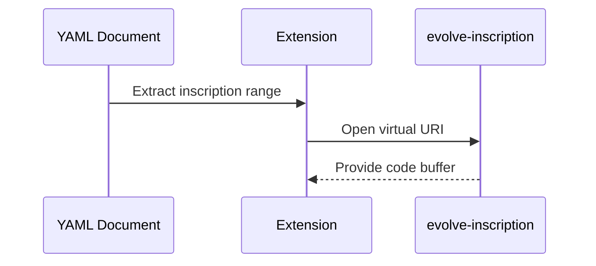

# PNML Editor (VS Code Extension)
 
 ## Implementation
 - Main extension code in editor/src/extension.ts.
 - Inscription helpers in editor/src/inscripted.ts.
 - Place indexing helpers in editor/src/placeIndex.ts.
 
 ## Features
 - YAML schema validation via yaml-language-server when installed.
 - Place-based breakpoints mapped to place id lines.
 - Virtual inscription editor using evolve-inscription filesystem.
 - Code lenses and commands to open inscriptions.
 - Run and debug commands wired to the Python engine and debug adapter.

## Inscription virtual file flow

