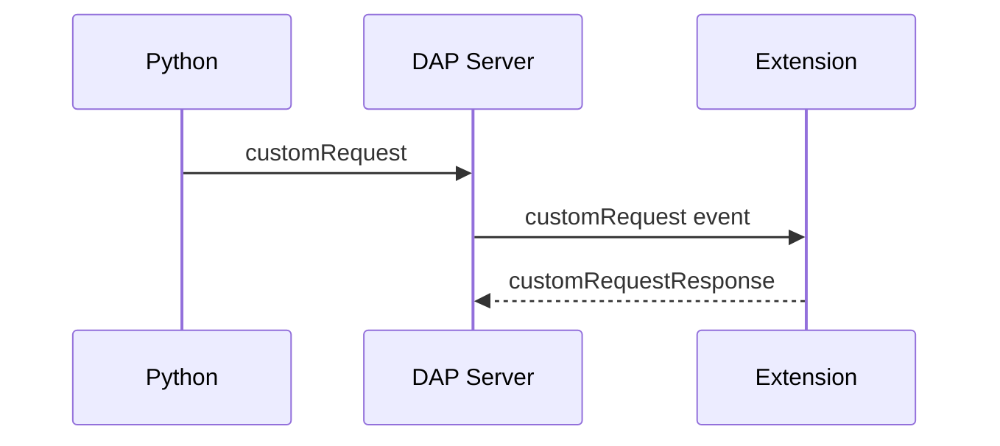

# VS Code Host Integration
 
 ## Implemented host responsibilities
 - Spawns the debug adapter for evolve-pnml using enginepy/pnml_dap.py.
 - Registers a DebugAdapterTracker that handles customRequest events from DAP.
 - Routes bridge requests to handlers: chat, executeCommand, getChatHistory, showMessage.
 
 ## Copilot chat handling
 - Selects Copilot models via the VS Code Language Model API.
 - Maintains in-memory chat history per conversation id.
 - Detects refusal/off-topic responses and optionally opens the chat UI.

## Generic async host responsibilities (planned)
- Maintain a `PendingOpsStore` keyed by `operationId` and `resumeToken` for async transitions.
- Update store from DAP events (`asyncOperationStarted`, `asyncOperationUpdated`, `asyncOperationCompleted`) and run-bridge websocket messages.
- Provide commands:
	- `evolve.listPendingOperations`
	- `evolve.resumeForm`
	- `evolve.cancelOperation`
	- `evolve.submitOperation`
- Provide Copilot slash commands:
	- `/jobs` (list pending ops with semantic metadata)
	- `/submit <token> <message>` (resume by token)
- Surface pending ops in UI:
	- Status bar item `Evolve: Pending (N)`
	- Notification toast with quick actions
- Clear pending ops on debug session end.

## Async event schema (planned)
```json
{
	"type": "asyncOperationStarted",
	"operationId": "op-123",
	"operationType": "form",
	"resumeToken": "evo_async_5f2c",
	"uiState": { "formSpec": {} },
	"transitionId": "t1",
	"transitionName": "Review",
	"netId": "generic_async",
	"runId": "run-1700000000",
	"metadata": { "timeout": 300000 }
}
```

## Request routing

