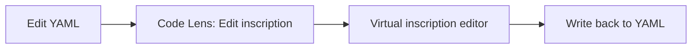

# Flow: Define and Edit PNML YAML
 
 ## What is implemented
 - YAML schema validation (when yaml-language-server is installed) for *.pnml.yaml and *.evolve.yaml.
 - Place symbol indexing for navigation and diagnostics.
 - Inline inscription editing via a virtual evolve-inscription document.
 - Commands to open inscription editor and open inscription at cursor.

## Typical edit loop

