# AgenticFlow

## Purpose
Define an agentic workflow generation and evaluation flow aligned with WorfBench and WorFEval, then adapt it to EVOLVE-style PNML workflows. The goal is to convert natural language tasks into executable, graph-structured workflows with explicit dependencies, and to score workflow quality at both node and graph levels.

This document is self-contained for an end-to-end run of WorfBench workflow generation and evaluation. Follow the steps exactly to reproduce baseline results or to evaluate a new model.

## Architecture Overview: WorfBench for PNML
WorfBench is a framework for generating and evaluating agentic workflows. It treats planning as a structured process:
1. **Node Generation**: decomposing a high-level task into atomic executable steps (Node Chain).
2. **Graph Construction**: linking steps with dependencies to identify parallel opportunities (DAG).

### Linear vs Graph Workflow
A key insight from WorfBench is that **graph workflows** enable parallel execution, outperforming naive sequential chains.

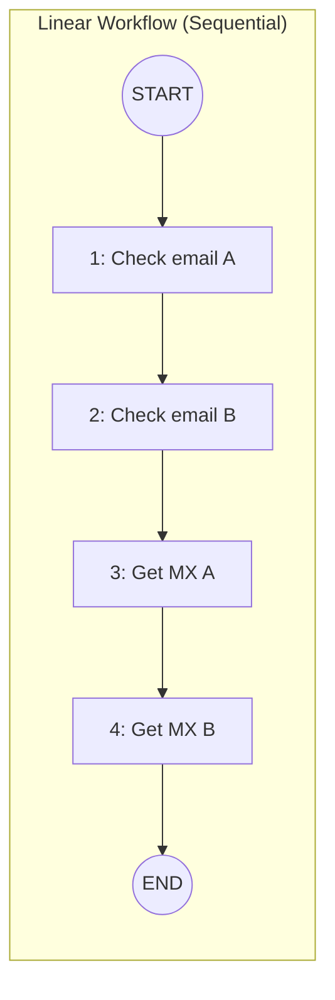

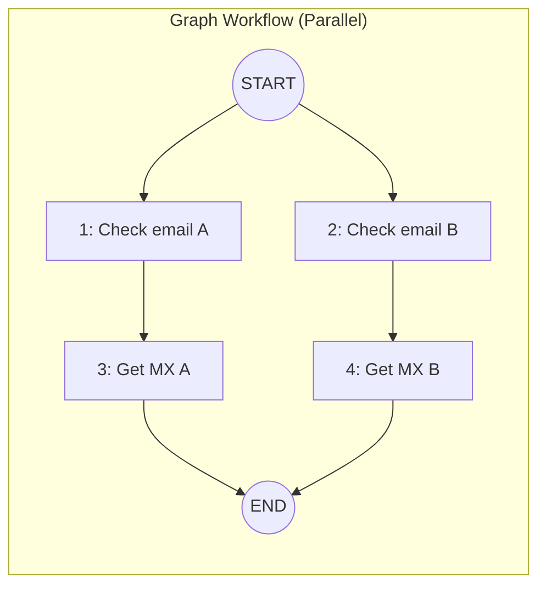

### WorfBench Pipeline

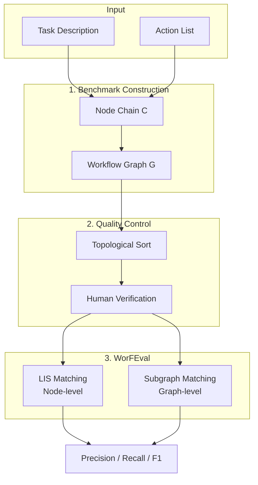

#### Input Block
| Element | Description |
|---------|-------------|
| **Task Description** | A natural language description of the user's goal (e.g., "Check if these emails are disposable and get their MX records"). |
| **Action List** | A set of available actions, APIs, or tools the agent can use (e.g., `check_for_disposable_emails`, `get_the_mx_records`). |

The inputs are formatted into a planner prompt following the few-shot examples in [prompts/eval_prompt.py](prompts/eval_prompt.py).

#### 1. Benchmark Construction
| Step | Description |
|------|-------------|
| **Node Chain C** | The LLM decomposes the task into a linear sequence of atomic subtasks. Each subtask maps to one action from the action list. The chain follows a ReAct-style (thought-action-observation) format. |
| **Workflow Graph G** | The LLM infers dependency edges between nodes. Independent subtasks get parallel edges from START; dependent subtasks form serial chains. Output: a DAG with `(START, i)`, `(i, j)`, `(j, END)` edges. |

The two-step approach (chain first, then edges) accommodates LLM generation habits and improves quality control.

#### 2. Quality Control
| Step | Description |
|------|-------------|
| **Topological Sort** | Verify that the generated graph is a valid DAG. Sort nodes in ascending index order when multiple nodes have in-degree 0. Discard samples where the sorted order does not match the original node chain. |
| **Human Verification** | Manual review of the test set to ensure correctness. Filters out ~30% of auto-generated samples that fail structure or semantic checks. |

Quality control ensures the benchmark is reliable for evaluation and training.

#### 3. WorFEval (Evaluation)
| Metric | Algorithm | What it measures |
|--------|-----------|------------------|
| **LIS Matching (Node-level)** | Longest Increasing Subsequence over matched node indices | Whether predicted subtasks appear in the correct relative order. |
| **Subgraph Matching (Graph-level)** | Largest Connected Component over matched edges | Whether parallel/serial structure is preserved. |

Both metrics report **Precision**, **Recall**, and **F1**. Node-level rewards correct ordering; graph-level rewards correct structure.

### Worked Example: Investment Consultation

**Task Description**:
> Given stock symbols AAPL and MSFT, search the internet for latest market data and sentiment, analyze historical trends, consider similar sector scenarios, factor in risk appetite, and make a buy/hold/sell recommendation.

**Action List**:
```json
[
  {"name": "get_stock_quote", "description": "Fetch latest price, volume, and change for a stock symbol"},
  {"name": "get_historical_data", "description": "Retrieve historical price data for a stock over a date range"},
  {"name": "search_news_sentiment", "description": "Search news and social media for sentiment on a stock"},
  {"name": "get_sector_performance", "description": "Get performance metrics for a sector (e.g., Tech)"},
  {"name": "get_similar_stocks", "description": "Find stocks with similar characteristics"},
  {"name": "assess_risk_profile", "description": "Evaluate risk appetite based on user profile"},
  {"name": "analyze_trends", "description": "Perform technical analysis on historical data"},
  {"name": "generate_recommendation", "description": "Produce buy/hold/sell recommendation with rationale"}
]
```

**Generated Node Chain**:
```
Node:
1: Fetch latest market data for AAPL
2: Fetch latest market data for MSFT
3: Search news sentiment for AAPL
4: Search news sentiment for MSFT
5: Get historical price data for AAPL
6: Get historical price data for MSFT
7: Get Tech sector performance
8: Find similar stocks to AAPL and MSFT
9: Assess user risk profile
10: Analyze trends for AAPL based on historical data
11: Analyze trends for MSFT based on historical data
12: Generate recommendation considering all analyses
```

**Generated Edges (Workflow Graph)**:
```
Edge: (START,1) (START,2) (START,3) (START,4) (START,5) (START,6) (START,7) (START,8) (START,9)
      (5,10) (6,11) (1,12) (2,12) (3,12) (4,12) (7,12) (8,12) (9,12) (10,12) (11,12) (12,END)
```

**Workflow Graph Visualization**:

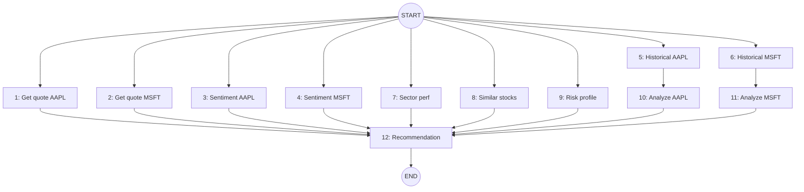

**Key observations**:
- Nodes 1–9 can execute **in parallel** (all have edges from START).
- Nodes 10 and 11 depend on historical data (serial after 5 and 6).
- Node 12 is a **join node** that waits for all analyses before generating the recommendation.

**Investment Flow as Petri Net Diagram**:

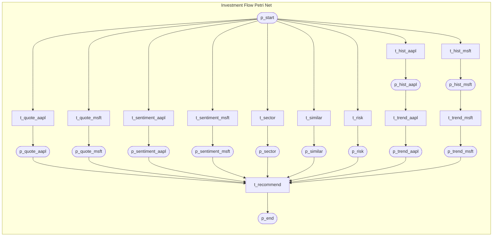

**Legend**: `([place])` = place (circle), `[transition]` = transition (rectangle). Tokens flow from `p_start`, fan out to parallel transitions, converge at `t_recommend` (AND-join), and terminate at `p_end`.

**Translated to EVOLVE PNML YAML** (excerpt):

```yaml
pnml:
  net:
    - id: investment_flow
      type: https://evolve.dev/pnml/hlpn/evolve-2009
      page:
        - id: page1
          place:
            - id: p_start
              name: { text: START }
              evolve:
                initialTokens:
                  - value: { symbols: ["AAPL", "MSFT"], riskTolerance: "moderate" }
            - id: p_quote_aapl
            - id: p_quote_msft
            - id: p_hist_aapl
            - id: p_hist_msft
            - id: p_trend_aapl
            - id: p_trend_msft
            - id: p_sentiment_aapl
            - id: p_sentiment_msft
            - id: p_sector
            - id: p_similar
            - id: p_risk
            - id: p_end
              name: { text: END }
          transition:
            - id: t_quote_aapl
              name: { text: "Fetch quote AAPL" }
              evolve:
                kind: http
                inscriptions:
                  - language: python
                    kind: expression
                    source: inline
                    code: "lambda d: get_stock_quote('AAPL')"
            - id: t_quote_msft
              name: { text: "Fetch quote MSFT" }
              evolve:
                kind: http
            - id: t_sentiment_aapl
              name: { text: "Sentiment AAPL" }
              evolve:
                kind: llm
            - id: t_sentiment_msft
              name: { text: "Sentiment MSFT" }
              evolve:
                kind: llm
            - id: t_hist_aapl
              name: { text: "Historical AAPL" }
              evolve:
                kind: http
            - id: t_hist_msft
              name: { text: "Historical MSFT" }
              evolve:
                kind: http
            - id: t_sector
              name: { text: "Sector performance" }
              evolve:
                kind: http
            - id: t_similar
              name: { text: "Similar stocks" }
              evolve:
                kind: compute
            - id: t_risk
              name: { text: "Assess risk profile" }
              evolve:
                kind: manual
                inscriptions:
                  - language: python
                    kind: expression
                    source: inline
                    execMode: async
                    code: "lambda d: vscode_bridge.show_form_async(risk_form_spec)"
            - id: t_trend_aapl
              name: { text: "Analyze AAPL trends" }
              evolve:
                kind: compute
            - id: t_trend_msft
              name: { text: "Analyze MSFT trends" }
              evolve:
                kind: compute
            - id: t_recommend
              name: { text: "Generate recommendation" }
              evolve:
                kind: llm
                inscriptions:
                  - language: python
                    kind: expression
                    source: inline
                    code: "lambda d: generate_recommendation(d)"
          arc:
            # START fan-out (parallel)
            - { id: a1, source: p_start, target: t_quote_aapl }
            - { id: a2, source: p_start, target: t_quote_msft }
            - { id: a3, source: p_start, target: t_sentiment_aapl }
            - { id: a4, source: p_start, target: t_sentiment_msft }
            - { id: a5, source: p_start, target: t_hist_aapl }
            - { id: a6, source: p_start, target: t_hist_msft }
            - { id: a7, source: p_start, target: t_sector }
            - { id: a8, source: p_start, target: t_similar }
            - { id: a9, source: p_start, target: t_risk }
            # Intermediate places
            - { id: a10, source: t_quote_aapl, target: p_quote_aapl }
            - { id: a11, source: t_quote_msft, target: p_quote_msft }
            - { id: a12, source: t_hist_aapl, target: p_hist_aapl }
            - { id: a13, source: t_hist_msft, target: p_hist_msft }
            - { id: a14, source: t_sentiment_aapl, target: p_sentiment_aapl }
            - { id: a15, source: t_sentiment_msft, target: p_sentiment_msft }
            - { id: a16, source: t_sector, target: p_sector }
            - { id: a17, source: t_similar, target: p_similar }
            - { id: a18, source: t_risk, target: p_risk }
            # Serial: historical -> trend analysis
            - { id: a19, source: p_hist_aapl, target: t_trend_aapl }
            - { id: a20, source: p_hist_msft, target: t_trend_msft }
            - { id: a21, source: t_trend_aapl, target: p_trend_aapl }
            - { id: a22, source: t_trend_msft, target: p_trend_msft }
            # Join into recommendation
            - { id: a23, source: p_quote_aapl, target: t_recommend }
            - { id: a24, source: p_quote_msft, target: t_recommend }
            - { id: a25, source: p_sentiment_aapl, target: t_recommend }
            - { id: a26, source: p_sentiment_msft, target: t_recommend }
            - { id: a27, source: p_sector, target: t_recommend }
            - { id: a28, source: p_similar, target: t_recommend }
            - { id: a29, source: p_risk, target: t_recommend }
            - { id: a30, source: p_trend_aapl, target: t_recommend }
            - { id: a31, source: p_trend_msft, target: t_recommend }
            # END
            - { id: a32, source: t_recommend, target: p_end }
```

**Runtime highlights**:
- `t_risk` uses `execMode: async` with a form to capture user risk tolerance interactively.
- `t_sentiment_*` and `t_recommend` use `kind: llm` for LLM-based analysis.
- The Petri Net enforces that `t_recommend` only fires when **all** input places have tokens (join semantics).

**Adapted to EVOLVE PNML**, the pipeline adds a translation layer:
- **Abstract DAG → Petri Net**: 
  - Each **Node** becomes a **Transition** (action).
  - Each **Edge** becomes a **Place** (state/token holder) + Arcs.
- **Execution Semantics**: 
  - Standard nodes become generic compute transitions.
  - Human-centric nodes become **Async Transitions** (e.g., chat participants) using the VS Code bridge.
- **Output**: A compliant [PNML YAML](schema/pnml.schema) file ready for the EVOLVE engine.

## Core Concepts
- Task: the user goal or problem statement.
- Action list: the available actions, tools, or APIs the workflow can use.
- Node chain: a topological sequence of executable subtasks.
- Workflow graph: a directed acyclic graph (DAG) where edges encode dependencies.

## Workflow Generation Pipeline
1. Normalize inputs
	- Format the task and action list as a planner prompt.
	- Constrain output to a strict Node/Edge schema.
2. Generate node chain
	- Produce a linear list of executable subtasks.
3. Infer dependencies
	- Add edges to express precedence constraints and parallel branches.
4. Validate DAG
	- Ensure acyclicity, connectivity between START and END, and coverage of all nodes.
5. Post-process
	- Normalize node text and reindex edges for downstream parsing.

## End-to-End: WorfBench CLI Workflow
### 1) Install dependencies
Run from the WorfBench root:

```bash
pip install -r requirements.txt
```

### 2) Start or configure a model endpoint
WorfBench expects an OpenAI-style API in [LLM/localLLM.py](LLM/localLLM.py). Ensure your model is reachable there. If you use a local LLaMA-Factory server, start it first:

```bash
git clone --depth 1 https://github.com/hiyouga/LLaMA-Factory.git
cd LLaMA-Factory
pip install -e ".[torch,metrics]"
API_PORT=8000 llamafactory-cli api examples/inference/llama3_vllm.yaml
```

### 3) Generate workflows (node chain + edges)
From the WorfBench root:

```bash
tasks=(wikihow toolbench toolalpaca lumos alfworld webshop os)
model_name=your_model_name
for task in ${tasks[@]}; do
	 python node_eval.py \
		  --task gen_workflow \
		  --model_name ${model_name} \
		  --gold_path ./gold_traj/${task}/graph_eval.json \
		  --pred_path ./pred_traj/${task}/${model_name}/graph_eval_two_shot.json \
		  --task_type ${task} \
		  --few_shot
done
```

### 4) Evaluate workflows
Choose either node-level or graph-level evaluation:

```bash
tasks=(wikihow toolbench toolalpaca lumos alfworld webshop os)
model_name=your_model_name
for task in ${tasks[@]}; do
	 python node_eval.py \
		  --task eval_workflow \
		  --model_name ${model_name} \
		  --gold_path ./gold_traj/${task}/graph_eval.json \
		  --pred_path ./pred_traj/${task}/${model_name}/graph_eval_two_shot.json \
		  --eval_model all-mpnet-base-v2 \
		  --eval_output ./eval_result/${model_name}_${task}_graph_eval_two_shot.json \
		  --eval_type node \
		  --task_type ${task}
done
```

### 5) Inspect results
Check the per-task JSON scores:

- [eval_result](eval_result)

## Changes Required to WorfBench
If you are integrating a new model or modifying the workflow format, update the following areas:

1) Model adapter
	- Update [LLM/localLLM.py](LLM/localLLM.py) to call your model endpoint and return text in the required Node/Edge format.

2) Prompt format contract
	- Ensure your prompt adheres to [prompts/eval_prompt.py](prompts/eval_prompt.py).
	- Keep the output strictly in:
	  - Node list
	  - Edge list

3) Output parsing
	- If your model output differs, update the regex in [node_eval.py](node_eval.py) in `workflow_to_node_list()` and `workflow_to_graph_list()`.

4) Evaluation tweaks
	- If you use a different embedding model or matching threshold, update [evaluator/graph_evaluator.py](evaluator/graph_evaluator.py) in `match_node()` and the evaluation entrypoints.

5) Dataset extension
	- Add new tasks to [gold_traj](gold_traj) with the same JSON schema as existing datasets.
	- Keep node chain and graph structure consistent with the expected format in [node_eval.py](node_eval.py).

## Evaluation (WorFEval)

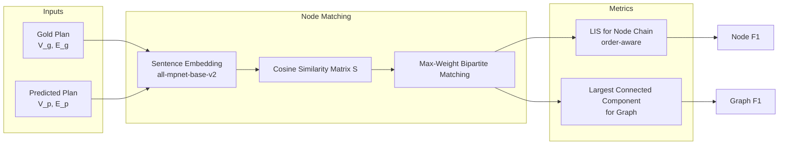

### Node-level (sequence)
- Embed predicted and gold node text with sentence embeddings.
- Find best node alignment with max-weight matching.
- Compute the longest increasing subsequence (LIS) over aligned indices to reward correct order.
- Report precision, recall, and F1.

### Graph-level (structure)
- Align predicted and gold nodes using embedding-based matching.
- Keep edges whose endpoints are both matched.
- Count the largest connected component over matched edges.
- Compute precision and recall against total nodes, then F1.

## Prompt Contract
- Output format:
  - Node:
	 1: <subtask>
	 2: <subtask>
  - Edge: (START,1) (1,2) (2,END)
- Keep subtasks at minimum executable granularity.
- Use parallel branches when independent.

## AgenticFlow for EVOLVE PNML
### Mapping rules
- Subtask node → transition.
- Dependency edge → arc between places and transitions.
- START/END → source and sink places.
- Parallel branches → split place with multiple outgoing arcs.
- Merge branches → join place with multiple incoming arcs.

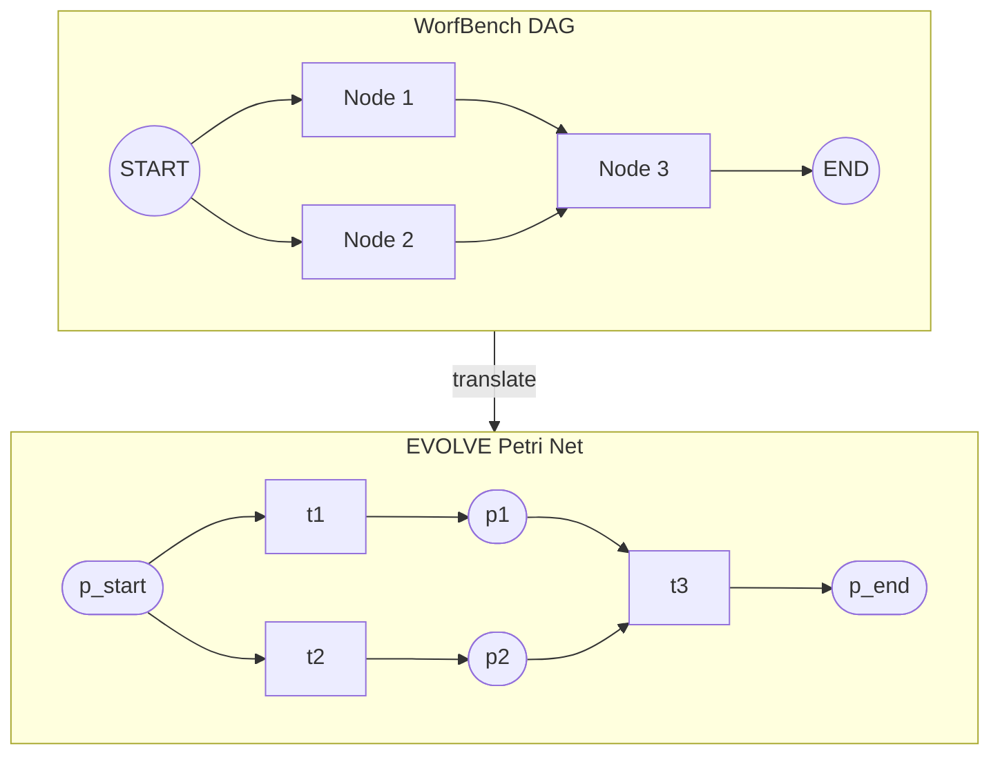

**Mapping detail**:
| DAG Element | PNML Element |
|-------------|---------------|
| START | Source place `p_start` with initial token |
| Node | Transition with inscription |
| Edge (A→B) | Place between A and B + arcs |
| END | Sink place `p_end` |

### BPMN Gateway Mapping to PNML
BPMN uses explicit gateway symbols for control flow. Petri Nets achieve the same semantics through place/transition topology.

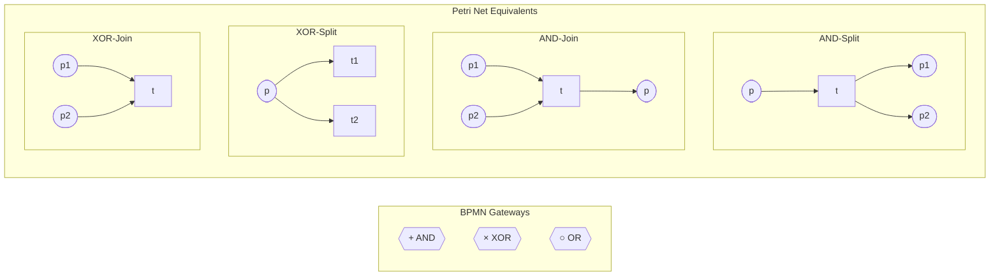

| BPMN Gateway | PNML Pattern | Semantics |
|--------------|--------------|-----------|
| **AND-Split** (parallel) | One transition with multiple output places | All branches execute concurrently |
| **AND-Join** (synchronize) | One transition with multiple input places | Waits for ALL tokens before firing |
| **XOR-Split** (exclusive) | One place with multiple output transitions + guards | Exactly one branch fires based on condition |
| **XOR-Join** (merge) | Multiple transitions feeding one place | First arriving token proceeds |
| **OR-Split** (inclusive) | Place with guarded transitions (0..N fire) | Any subset of branches may fire |
| **OR-Join** (inclusive merge) | Complex pattern: use inhibitor arcs or colored tokens | Wait for all active branches |

**XOR with guards in PNML YAML**:
```yaml
transition:
  - id: t_path_a
    name: { text: "Path A" }
    evolve:
      inscriptions:
        - language: python
          kind: guard
          code: "lambda d: d['choice'] == 'A'"
  - id: t_path_b
    name: { text: "Path B" }
    evolve:
      inscriptions:
        - language: python
          kind: guard
          code: "lambda d: d['choice'] == 'B'"
arc:
  - { id: a1, source: p_decision, target: t_path_a }
  - { id: a2, source: p_decision, target: t_path_b }
```

### Target output format (PNML YAML)
The workflow output for EVOLVE must be PNML YAML that conforms to the schema in [schema/pnml.schema](schema/pnml.schema). At minimum, ensure:
- Net has `id` and `type` matching the EVOLVE HLPN URI.
- A top-level `page` exists with `place`, `transition`, and `arc` arrays.
- Each place/transition/arc has `id` and required references (`source`, `target`).
- Use `evolve` extensions for transition kinds and inscriptions.

Minimal PNML YAML skeleton:

```yaml
pnml:
	net:
		- id: flow1
			type: https://evolve.dev/pnml/hlpn/evolve-2009
			page:
				- id: page1
					place:
						- id: p_start
							name: { text: START }
						- id: p_end
							name: { text: END }
					transition:
						- id: t1
							name: { text: Subtask 1 }
							evolve:
								kind: compute
								inscriptions:
									- language: python
										kind: expression
										source: inline
										code: "lambda d: d"
					arc:
						- id: a1
							source: p_start
							target: t1
						- id: a2
							source: t1
							target: p_end
```

### Runtime support
- For human-in-the-loop steps, prefer async transitions and pending operations.
- Use structured payloads (form schema + initial values) for interactive steps.

### VS Code chat + async participant flow
Support async participant operations as defined in [kb/5.epic/000.00.003.GenericAsyncTransition.md](kb/5.epic/000.00.003.GenericAsyncTransition.md) by emitting pending operations with `operationType: copilot_participant` and exposing resume tokens through the host UI.

Required host behavior:
- Register pending ops in the VS Code extension and surface them in a status bar item.
- Provide `/jobs` to list pending operations and `/submit <token> <message>` to resume.
- Accept `POST /submit` with `{ resumeToken, result }` for HTTP resumes.

PNML YAML example for a participant step (async):

```yaml
pnml:
	net:
		- id: flow1
			type: https://evolve.dev/pnml/hlpn/evolve-2009
			page:
				- id: page1
					place:
						- id: p_start
							name: { text: START }
						- id: p_end
							name: { text: END }
					transition:
						- id: t_participant
							name: { text: Ask copilot participant }
							evolve:
								kind: manual
								inscriptions:
									- language: python
										kind: expression
										source: inline
										execMode: async
										code: "lambda d: vscode_bridge.participant_async('Review this')"
					arc:
						- id: a1
							source: p_start
							target: t_participant
						- id: a2
							source: t_participant
							target: p_end
```

### Validation gates
- DAG validation at the workflow layer before PNML emission.
- PNML schema validation after generation.
- Optional simulation to detect deadlocks and unreachable transitions.

## Implementation Notes
- Inference: follow the strict Node/Edge output format to reduce parsing errors.
- Parsing: extract nodes and edges; normalize START/END to indices.
- Evaluation: use node-level metrics for ordering quality and graph-level metrics for structural fidelity.
- Feedback loop: when evaluation fails, regenerate edges first, then nodes if needed.

## Acceptance Criteria
- Generates a DAG with correct START/END coverage.
- Uses parallel edges where tasks are independent.
- Passes node-level and graph-level evaluations above baseline for the target domain.
- Produces valid PNML for execution in the EVOLVE engine.

## WorfBench Training and Models
**Does WorfBench train its own LLM models?**

Yes. The WorfBench paper describes training two open-source models on the 18k training samples:
- Fine-tuned **LLaMA-2-7B** and **LLaMA-2-13B** using the training set.
- Evaluated generalization on held-out tasks (Seal-Tools, InterCodeSQL).

However, the **primary use case** is benchmarking existing LLMs (GPT-4, Claude, LLaMA, etc.) on workflow generation. Training is optional and demonstrates that workflow generation can be learned.

**To train your own model**:
1. Use [LLaMA-Factory](https://github.com/hiyouga/LLaMA-Factory) with the training data from [gold_traj](gold_traj).
2. Format training data as conversation pairs (task + action list → node chain + edges).
3. Fine-tune with supervised learning on the Node/Edge output format.

## EVOLVE PNML Generation (Latest Implementation)
The EVOLVE generator now enforces schema-aligned output and retries on validation errors instead of falling back to a minimal net.

### Behavior summary
- `pnml_generator.from_ideation(...)` validates ideation, calls Copilot via `vscode_bridge.chat`, and retries on PNML validation failures.
- Retry prompts include the validation error message and the prior invalid output to help the model self-correct.
- Maximum retries are controlled by `EVOLVE_PNML_MAX_RETRIES` (default: 3). Total attempts are $\text{maxRetries} + 1$.
- The generator injects a schema excerpt (from [schema/pnml.schema](schema/pnml.schema)) covering `transition`, `evolveTransition`, and `evolveInscription` so inscriptions follow the required grammar.
- Deterministic policy is applied after validation (see `policy/first_version.ensure_deterministic_pnml`).

### Schema access for generation
- The extension exposes the schema via the command `evolve.getPnmlSchema`.
- `pnml_generator.from_ideation(...)` retrieves the schema through `vscode_bridge.execute_command` when available, with a local file fallback for dev runs.

### Prompt contract for generation
- Return **only** PNML YAML.
- Use `evolve.inscriptions` with explicit `language`, `kind`, `source`, `code`, and optional `execMode` fields.
- Avoid single-line `lambda` returns for async steps; use `return vscode_bridge.<...>_async(...)` in multi-line blocks.

## Prompt: PNML YAML to Mermaid Petri Net Diagram

Use this prompt to convert PNML YAML into a Mermaid Petri Net diagram:

```markdown
You are a Petri Net visualization assistant. Given PNML YAML input, generate a Mermaid flowchart that represents the Petri Net structure.

**Rules**:
1. Places are rendered as `([place_id])` (stadium shape = circle).
2. Transitions are rendered as `[transition_id]` (rectangle).
3. Arcs connect places to transitions or transitions to places.
4. Use `subgraph` to group the net with a descriptive title.
5. Add a legend comment explaining the notation.
6. **Wrap all labels in double quotes** and use `<br>` instead of `\n` inside the quoted string to indicate line breaks and escape any double quotes inside a label with `\"` to prevent Mermaid parse errors.

**Label rule example**:
- Bad (causes parse error): `T_form[t_form<br/>(async — show_form_async)]`
- Good: `T_form["t_form\n(async - show_form_async)"]`

**Input PNML YAML**:
```yaml
{paste PNML YAML here}
```

**Output format**:
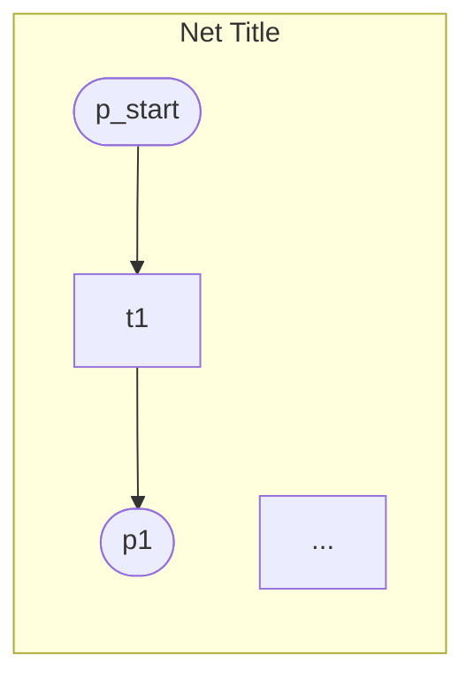

**Example output for a simple net**:
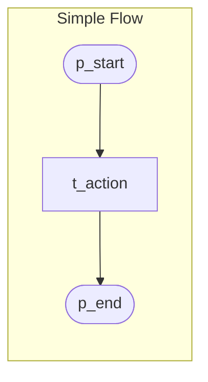

Now generate the Mermaid diagram for the provided PNML YAML.
```

**Usage**: Paste the prompt into a chat interface along with your PNML YAML to get a visual diagram.

**VS Code integration (latest)**:
- Right-click any `.evolve.yaml` or `.pnml.yaml` file and run **EVOLVE: Generate Mermaid Diagram**.
- The command sends:
  - A **system prompt** populated with the rules from this section.
  - A **user prompt** containing the full PNML YAML file content.
- Output opens as a new Markdown document containing a Mermaid code block.

## Revamping WorfBench for Native PNML YAML Output

To make WorfBench generate PNML YAML natively instead of DAG (Node/Edge), the following changes are required:

### Architecture Changes

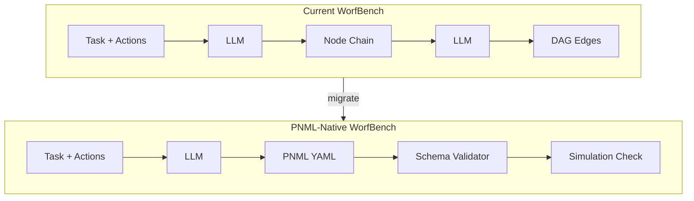

### File Changes Required

| File | Current | Proposed Change |
|------|---------|-----------------|
| **prompts/eval_prompt.py** | Node/Edge text format | PNML YAML few-shot examples |
| **node_eval.py** | `workflow_to_node_list()`, `workflow_to_graph_list()` | `workflow_to_pnml()` YAML parser |
| **evaluator/graph_evaluator.py** | DAG comparison | PNML structure comparison (places, transitions, arcs) |
| **gold_traj/*.json** | `{"nodes": [...], "edges": [...]}` | `{"pnml": {"net": [...]}}` |
| **LLM/localLLM.py** | Returns text | Returns YAML, add YAML validation |

### New Modules to Add

1. **pnml_parser.py**: Parse PNML YAML to internal graph representation.
2. **pnml_validator.py**: Validate against [schema/pnml.schema](schema/pnml.schema).
3. **pnml_evaluator.py**: Compare predicted vs gold PNML (structural + semantic).
4. **mermaid_generator.py**: Convert PNML YAML to Mermaid diagrams.

### Prompt Format Change

**Current prompt output**:
```
Node:
1: Fetch data for AAPL
2: Analyze trends
Edge: (START,1) (1,2) (2,END)
```

**Proposed PNML YAML output**:
```yaml
pnml:
  net:
    - id: workflow
      type: https://evolve.dev/pnml/hlpn/evolve-2009
      page:
        - id: page1
          place:
            - id: p_start
            - id: p1
            - id: p_end
          transition:
            - id: t1
              name: { text: "Fetch data for AAPL" }
            - id: t2
              name: { text: "Analyze trends" }
          arc:
            - { id: a1, source: p_start, target: t1 }
            - { id: a2, source: t1, target: p1 }
            - { id: a3, source: p1, target: t2 }
            - { id: a4, source: t2, target: p_end }
```

## Implementation Plan

### Phase 1: Foundation (Week 1-2)
| Task | Description | Files |
|------|-------------|-------|
| 1.1 | Create PNML YAML parser module | `pnml_parser.py` |
| 1.2 | Create PNML schema validator | `pnml_validator.py` |
| 1.3 | Create Mermaid generator from PNML | `mermaid_generator.py` |
| 1.4 | Unit tests for parser and validator | `tests/test_pnml_parser.py` |

### Phase 2: Prompt Engineering (Week 2-3)
| Task | Description | Files |
|------|-------------|-------|
| 2.1 | Design PNML YAML few-shot examples | `prompts/pnml_prompt.py` |
| 2.2 | Add gateway examples (AND/XOR/OR) | `prompts/pnml_prompt.py` |
| 2.3 | Test prompt with GPT-4 and Claude | Manual testing |
| 2.4 | Iterate on prompt based on output quality | `prompts/pnml_prompt.py` |

### Phase 3: Evaluation Pipeline (Week 3-4)
| Task | Description | Files |
|------|-------------|-------|
| 3.1 | Create PNML evaluator (structural comparison) | `evaluator/pnml_evaluator.py` |
| 3.2 | Adapt node matching for transition names | `evaluator/pnml_evaluator.py` |
| 3.3 | Add arc topology comparison | `evaluator/pnml_evaluator.py` |
| 3.4 | Integration tests with sample PNML | `tests/test_pnml_evaluator.py` |

### Phase 4: Dataset Migration (Week 4-5)
| Task | Description | Files |
|------|-------------|-------|
| 4.1 | Convert gold_traj JSON to PNML YAML format | `scripts/migrate_gold_traj.py` |
| 4.2 | Validate migrated data against schema | `scripts/validate_gold_traj.py` |
| 4.3 | Update node_eval.py for PNML mode | `node_eval.py` |
| 4.4 | Add `--output-format pnml` CLI flag | `node_eval.py` |

### Phase 5: Integration & Testing (Week 5-6)
| Task | Description | Files |
|------|-------------|-------|
| 5.1 | End-to-end test: task → PNML YAML → eval | `tests/test_e2e_pnml.py` |
| 5.2 | Benchmark GPT-4 on PNML output | Manual run |
| 5.3 | Compare metrics: DAG vs PNML mode | Analysis |
| 5.4 | Documentation update | `doc/AgenticFlow.md`, `README.md` |

## Testing Steps

### Unit Tests

```bash
# 1. Test PNML parser
pytest tests/test_pnml_parser.py -v

# 2. Test schema validation
pytest tests/test_pnml_validator.py -v

# 3. Test Mermaid generation
pytest tests/test_mermaid_generator.py -v

# 4. Test PNML evaluator
pytest tests/test_pnml_evaluator.py -v
```

### Integration Tests

```bash
# 1. Validate all migrated gold trajectories
python scripts/validate_gold_traj.py --format pnml

# 2. Run generation with PNML output
python node_eval.py \
    --task gen_workflow \
    --model_name gpt-4 \
    --gold_path ./gold_traj/toolbench/pnml_eval.json \
    --pred_path ./pred_traj/toolbench/gpt-4/pnml_eval.json \
    --output_format pnml \
    --few_shot

# 3. Run PNML evaluation
python node_eval.py \
    --task eval_workflow \
    --gold_path ./gold_traj/toolbench/pnml_eval.json \
    --pred_path ./pred_traj/toolbench/gpt-4/pnml_eval.json \
    --eval_type pnml \
    --eval_output ./eval_result/gpt-4_toolbench_pnml.json
```

### Acceptance Tests

| Test Case | Expected Result |
|-----------|-----------------|
| Parse valid PNML YAML | Returns internal graph object |
| Parse invalid PNML YAML | Raises validation error with line number |
| Generate Mermaid from PNML | Valid Mermaid syntax, renders correctly |
| Evaluate identical PNML | F1 = 1.0 |
| Evaluate missing transition | Recall < 1.0, Precision = 1.0 |
| Evaluate extra transition | Precision < 1.0, Recall = 1.0 |
| AND-join semantics preserved | Transition has multiple input arcs |
| XOR-split with guards | Transitions have guard inscriptions |
| End-to-end investment example | Generates valid PNML matching reference |

### Regression Tests

```bash
# Ensure DAG mode still works (backward compatibility)
python node_eval.py \
    --task gen_workflow \
    --output_format dag \
    --gold_path ./gold_traj/toolbench/graph_eval.json \
    ...

# Compare DAG vs PNML metrics on same tasks
python scripts/compare_dag_pnml_metrics.py \
    --dag_results ./eval_result/gpt-4_toolbench_dag.json \
    --pnml_results ./eval_result/gpt-4_toolbench_pnml.json
```

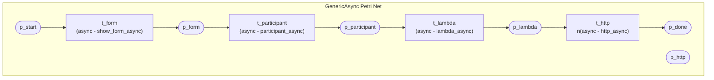